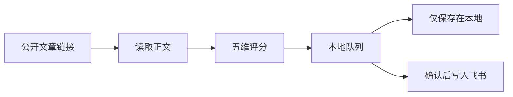

<div align="center">

# 微信公众号文章链接审阅器

读取用户给出的公开文章，完成五维评分，并在逐篇确认后可选写入飞书多维表格。

[](https://github.com/Gary-Luo1/Wechat-Article-Analysis/blob/main/LICENSE)
[](https://github.com/Gary-Luo1/Wechat-Article-Analysis/actions)
[](https://github.com/Gary-Luo1/Wechat-Article-Analysis/stargazers)

</div>

## 这是什么

这是一个 Agent Skill。它只处理用户明确给出的 `mp.weixin.qq.com/s` 公开链接：读取正文、按当前评分标尺打分、把元数据和正文指纹写入本地队列。飞书同步是可选步骤，必须等这篇文章得到明确确认。

它不监控公众号，也不使用微信 Cookie 或 token。文章正文按不可信数据处理。本地队列不保存正文。



## 快速开始

需要 Python 3.10+，以及能访问公开微信文章的网络。

macOS / Linux：

```bash
bash install.sh --target agents
```

Windows：

```powershell
pwsh -File .\install.ps1 -Target agents
```

安装器还支持 `codex`、`claude`、`copilot`、`openclaw`、`hermes` 和 `all`。默认会创建隔离 Python 环境。依赖已经就绪时，用 `--no-deps` 或 `-NoDeps`。

安装并重启 Agent 后，直接发送链接：

```text
请审阅这篇文章：https://mp.weixin.qq.com/s/...
```

检查当前仓库里的运行环境：

```bash
bash .agents/skills/wechat-article-link-reviewer/scripts/run.sh manage doctor
```

## 写入飞书

评分完成后，是否写入由 `manage status` 的 `review.after_scoring` 决定。

1. 本任务已选定飞书目标。已保存的「跳过」不会反复追问；还没配置时，先出评分，再询问。
2. 当前这篇文章得到明确确认。同一条消息里已经要求写入这篇时，不再追问「写入」。分数低于 `settings.min_score`（默认 6.0）仍要单独确认。

Cursor 等独立环境使用飞书用户身份。Bot 写入只在 `openclaw`、`hermes`、`lark-channel` 上可用，并且只能写已有表格。新建 Base 始终使用用户身份。

完成审阅用 `process done --link`。JSON 结果里看 `feishu_written`、`feishu_action`、`document_url` 和 `record_url`。回报可打开的表格链接，不要输出表格 token。

默认评分标尺是 `technical`。公众号运营和合规文章用：

```bash
bash .agents/skills/wechat-article-link-reviewer/scripts/run.sh manage settings set --rubric content_ops
```

阈值、正文去重和标尺都在 `manage settings` 里。

## 项目结构

```text
.agents/
└── skills/wechat-article-link-reviewer/
    ├── references/
    ├── scripts/
    ├── requirements.txt
    └── SKILL.md
.github/
└── workflows/
    └── ci.yml
tests/
└── test_link_review.py
.gitignore
install.ps1
install.sh
LICENSE
README.md
```

## 文档

| 文档 | 内容 |
| --- | --- |
| [SKILL.md](.agents/skills/wechat-article-link-reviewer/SKILL.md) | 审阅顺序、确认规则和命令入口 |
| [评分标准](.agents/skills/wechat-article-link-reviewer/references/scoring.md) | `technical` 与 `content_ops` 的维度和权重 |
| [飞书配置](.agents/skills/wechat-article-link-reviewer/references/feishu.md) | 表格绑定、用户登录和写入回执 |
| [安装与运行环境](.agents/skills/wechat-article-link-reviewer/references/setup.md) | 安装目标、Python 依赖和宿主差异 |
| [队列与运维](.agents/skills/wechat-article-link-reviewer/references/operations.md) | 本地队列、导出和清理 |
| [自动化边界](.agents/skills/wechat-article-link-reviewer/references/automation.md) | 哪些步骤可以自动执行，哪些必须等人确认 |

## 参与贡献

欢迎提 Issue 和 Pull Request。改动脚本后，在仓库根目录运行：

```bash
python -m pip install -r .agents/skills/wechat-article-link-reviewer/requirements.txt
PYTHONPATH=.agents/skills/wechat-article-link-reviewer/scripts python -m unittest discover -s tests -v
```

<a href="https://github.com/Gary-Luo1/Wechat-Article-Analysis/graphs/contributors">
  
</a>

## 许可证

[MIT License](LICENSE)。

<div align="center">

[](https://star-history.com/#Gary-Luo1/Wechat-Article-Analysis&Date)

</div>
